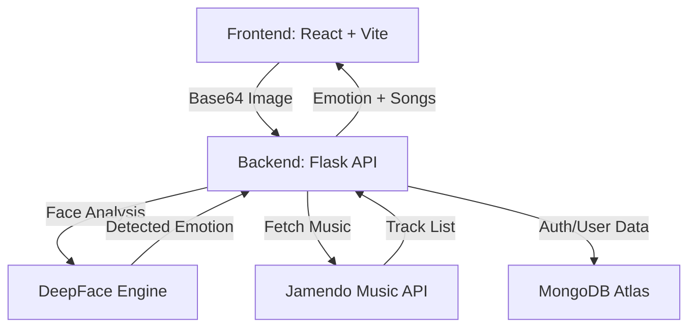

# 🎵 VibeSync: Emotion-Based Music Recommendation System

VibeSync is a sophisticated web application that uses Artificial Intelligence to detect your current mood through your webcam and recommends personalized music tracks to match or enhance your "vibe".

## 🚀 Key Features
- **Real-time Emotion Detection**: Uses state-of-the-art DeepFace models for high-accuracy facial expression analysis.
- **Smart Recommendations**: Maps detected emotions (Happy, Sad, Angry, Fear, etc.) to specific music genres and moods.
- **Music Playback**: Integrated Jamendo API for high-quality, free music streams.
- **Secure Authentication**: JWT-based login and registration system.
- **Modern UI**: Immersive, responsive design built with React and Tailwind CSS.

---

## 🏗️ Architecture
The system follows a decoupled Client-Server architecture:



---

## 🛠️ Tech Stack
- **Frontend**: React, Vite, Tailwind CSS, Lucide React (Icons).
- **Backend**: Flask, DeepFace, TensorFlow.
- **Database**: MongoDB Atlas.
- **APIs**: Jamendo API.

---

## 📋 Installation & Setup

### Prerequisites
- Python 3.8+
- Node.js & npm
- A MongoDB Atlas account (for database)

### 1. Backend Setup
1. Navigate to the backend directory:
   ```bash
   cd backend
   ```
2. Create and activate a virtual environment:
   ```bash
   python -m venv venv
   # On Windows:
   .\venv\Scripts\activate
   ```
3. Install dependencies:
   ```bash
   pip install -r requirements.txt
   ```
4. Create a `.env` file in the `backend` folder and add your credentials:
   ```env
   MONGO_URI=your_mongodb_cluster_uri
   JWT_SECRET_KEY=your_secret_key
   ```
5. Run the backend:
   ```bash
   python app.py
   ```

### 2. Frontend Setup
1. Navigate to the frontend directory:
   ```bash
   cd frontend
   ```
2. Install dependencies:
   ```bash
   npm install
   ```
3. Run the development server:
   ```bash
   npm run dev
   ```

---

## 📂 Project Structure
```
VibeSync/
├── backend/
│   ├── app.py              # Main Flask entry point
│   ├── emotion_detector.py # DeepFace logic
│   ├── music_api.py        # Music recommendation logic
│   ├── requirements.txt    # Backend dependencies
│   └── music/              # Static music assets (if any)
├── frontend/
│   ├── src/                # React source code
│   ├── public/             # Static assets
│   ├── package.json        # Frontend dependencies
│   └── tailwind.config.js  # Styling configuration
└── README.md               # You are here!
```

---

## 🛡️ Future Enhancements
- [ ] Integration with Spotify API for a larger music library.
- [ ] Historical emotion tracking for personalized user profiles.
- [ ] Multi-face support for "Group Vibe" recommendations.

## 📄 License
This project is licensed under the MIT License - see the LICENSE file for details.
